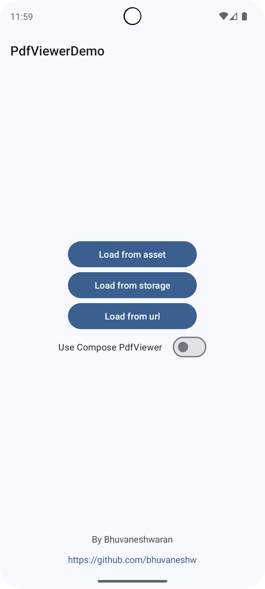
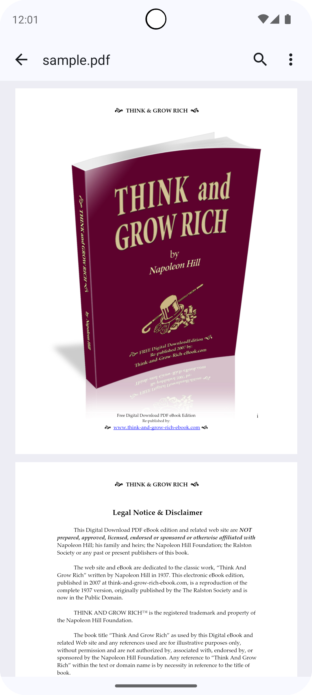
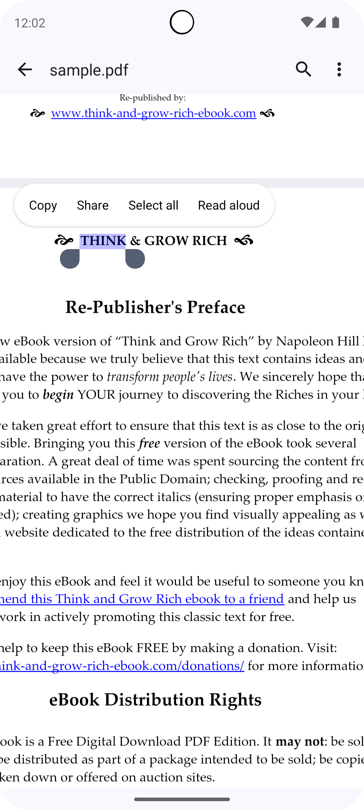
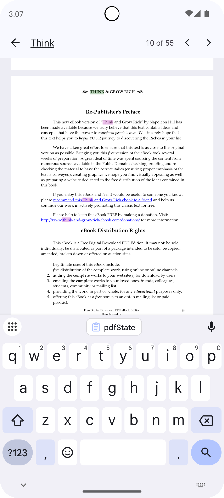
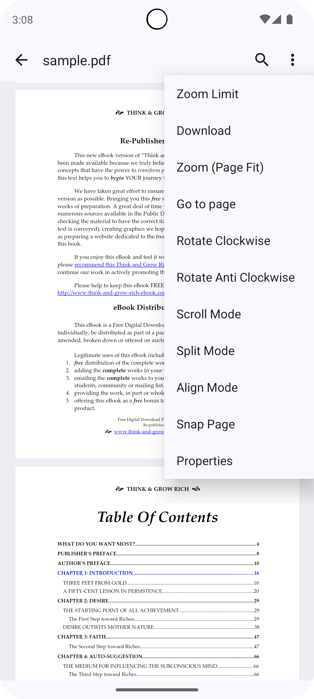

# PdfViewer

A lightweight **Android PDF viewer library** powered by Mozilla's [PDF.js](https://github.com/mozilla/pdf.js), offering seamless PDF rendering and interactive features. Supports both Jetpack Compose and Xml.

## Screenshots
 
  

## Demo
You can download apk from [here](/app/release/app-release.apk)

## Contents
1. [Setup](#1-setup)<br>
   1.1. [Setup - Kotlin DSL](#11-kotlin-dsl)<br>
   1.2. [Setup - Groovy DSL](#12-groovy-dsl)<br>
2. [Usage](#2-usage)<br>
   2.1. [XML PdfViewer](#21-xml-pdfviewer)<br>
   2.2 [Jetpack Compose PdfViewer](#22-jetpack-compose-pdfviewer)<br>
   2.3. [More Examples](#23-more-examples)<br>
3. [See also](#3-see-also)<br>
4. [Public Members](#4-public-members)<br>
5. [License](#5-license)
6. [External Libraries used](#6-external-libraries-used)

## 1. Setup
### 1.1. Kotlin DSL
Step 1. Add the JitPack repository to your build file

Add it in your root build.gradle.kts or settings.gradle.kts at the end of repositories:
```kotlin
dependencyResolutionManagement {
  repositoriesMode.set(RepositoriesMode.FAIL_ON_PROJECT_REPOS)
  repositories {
    mavenCentral()
    maven("https://jitpack.io")
  }
}
```
Step 2. Add the dependency
```kotlin
dependencies {
    implementation("com.github.bhuvaneshw.pdfviewer:$module:$version")
}
```
Replace <b>$module</b> with <b>core</b>, <b>ui</b>, <b>compose</b> and  <b>compose-ui</b>
Replace <b>$version</b> with latest version<br> 
Latest Version: <br>
[](https://jitpack.io/#bhuvaneshw/pdfviewer)


Example:

Only core PdfViewer
```kotlin
implementation("com.github.bhuvaneshw.pdfviewer:core:1.0.0")
```
With PdfViewerContainer, PdfToolBar and PdfScrollBar
```kotlin
implementation("com.github.bhuvaneshw.pdfviewer:core:1.0.0")
implementation("com.github.bhuvaneshw.pdfviewer:ui:1.0.0")
```

Only core Compose PdfViewer
```kotlin
implementation("com.github.bhuvaneshw.pdfviewer:compose:1.0.0")
```
With Compose PdfViewerContainer, PdfToolBar and PdfScrollBar
```kotlin
implementation("com.github.bhuvaneshw.pdfviewer:compose:1.0.0")
implementation("com.github.bhuvaneshw.pdfviewer:compose-ui:1.0.0")
```

## 1.2. Groovy DSL
Step 1. Add the JitPack repository to your build file

Add it in your root build.gradle or settings.gradle at the end of repositories:
```groovy
dependencyResolutionManagement {
  repositoriesMode.set(RepositoriesMode.FAIL_ON_PROJECT_REPOS)
  repositories {
      mavenCentral()
      maven { url 'https://jitpack.io' }
  }
}
```
Step 2. Add the dependency
```groovy
dependencies {
    implementation 'com.github.bhuvaneshw.pdfviewer:$module:$version'
}
```

## 2. Usage
### 2.1 XML PdfViewer
Include PdfViewer in your xml
```xml
<com.acutecoder.pdf.PdfViewer
    android:id="@+id/pdf_viewer"
    android:layout_width="match_parent"
    android:layout_height="match_parent"
    android:background="@color/md_theme_primaryContainer"
    app:containerBackgroundColor="@android:color/transparent" />
```
Then call load function
```kotlin
  // Kotlin
  pdfViewer.onReady {
    load(source)
  }
```
```java
  // Java
  PdfUtil.onReady(pdfViewer, () -> {
    pdfViewer.load(source);
  });
```

source can be
 1. Asset Path like "file:///android_asset/sample.pdf"
 2. Android Uri
 3. Network url like "https://example.com/sample.pdf"
 4. ~~Direct file path  like "/sdcard/Downloads/sample.pdf" or "file:///sdcard/Downloads/sample.pdf"(not recommended)~~

### 2.2 Jetpack Compose PdfViewer

Include compose dependency

```
val pdfState = rememberPdfState(source = source)
PdfViewer(  
    pdfState = pdfState,  
    modifier = Modifier,  
    containerColor = Color.Transparent,  
    onReady = {
      // Optional work
  }  
)
```

> [!WARNING]
> You should not access below members before the PdfViewer is initialized!
> 1. PdfViewer.load()
> 2. PdfViewer.ui
> 3. PdfViewer.findController
> 4. PdfViewer.pageScrollMode
> 5. PdfViewer.pageSpreadMode
> 6. PdfViewer.cursorToolMode
> 7. PdfViewer.pageRotation
> 8. PdfViewer.doubleClickThreshold
> 9. PdfViewer.longClickThreshold
> 10. PdfViewer.snapPage
> 11. PdfViewer.pageAlignMode
> 12. PdfViewer.singlePageArrangement
> 13. PdfViewer.scrollSpeedLimit

### 2.3 More Examples
1. For XML examples see [XML Examples](README_XML.md)
2. For Jetpack Compose examples see [Jetpack Compose Examples](README_COMPOSE.md)

## 3. See also
> [!NOTE]
> [PdfViewerActivity.kt](/app/src/main/java/com/acutecoder/pdfviewerdemo/PdfViewerActivity.kt) <br>
> [ComposePdfViewerActivity.kt](/app/src/main/java/com/acutecoder/pdfviewerdemo/ComposePdfViewerActivity.kt)<br>
> [PdfViewerContainer.kt](/ui/src/main/java/com/acutecoder/pdf/ui/PdfViewerContainer.kt)<br>
> [PdfScrollBar.kt](/ui/src/main/java/com/acutecoder/pdf/ui/PdfScrollBar.kt)<br>
> [PdfToolBar.kt](/ui/src/main/java/com/acutecoder/pdf/ui/PdfToolBar.kt)<br>
> [ExtendedToolBar.kt](/app/src/main/java/com/acutecoder/pdfviewerdemo/ExtendedToolBar.kt)<br>

## 4. Public Members
`isInitialized: Boolean`
Indicates whether the PDF viewer has been initialized.

`currentUrl: String?`
The current URL of the loaded PDF document.

`currentPage: Int`
The current page number of the PDF document.

`pagesCount: Int`
The total number of pages in the currently loaded PDF document.

`currentPageScale: Float`
The scale factor of the current page (zoom level).

`currentPageScaleValue: String`
The current scale value of the PDF page (e.g., `page-fit`, `auto`).

`properties: PdfDocumentProperties?`
The properties of the currently loaded PDF document, such as title, author, etc.

`ui: UiSettings`
Returns the `UiSettings` for the PDF viewer. Provides settings related to the UI provided by Mozill's PDF.js.

`findController: FindController`
Returns the `FindController` for the PDF viewer. Provides functionality for finding text in the PDF.

`pageScrollMode: PageScrollMode`
Defines the page scroll mode (e.g., vertical, horizontal, wrapped).

`pageSpreadMode: PageSpreadMode`
Defines the page spread mode (e.g., none, odd, even).

`cursorToolMode: CursorToolMode`
Defines the cursor tool mode (e.g., text select, hand tool).

`load(url: String, originalUrl: String = url)`
Loads a PDF file from the specified `url`. The `originalUrl` parameter is optional and defaults to the `url`.

`onReady(onReady: PdfOnReadyListener)`
Registers a listener that gets called when the PDF viewer is initialized and ready.

`addListener(listener: PdfListener)`
Adds a listener to be notified of PDF events (e.g., page load).

`removeListener(listener: PdfListener)` and `removeListener(listener: PdfOnReadyListener)`
Removes a previously added listener.

`goToPage(pageNumber: Int)`
Navigates to the specified page number in the PDF.

`scrollToRatio(ratio: Float)`
Scrolls the viewer to a specific ratio (0f - 1f) (calculated to offset).

`scrollTo(offset: Int)`
Scrolls the viewer to the specified offset.

`goToNextPage()`
Navigates to the next page in the PDF.

`goToPreviousPage()`
Navigates to the previous page in the PDF.

`goToFirstPage()`
Navigates to the first page in the PDF.

`goToLastPage()`
Navigates to the last page in the PDF.

`scalePageTo(scale: Float)`
Zooms the current page to the specified scale factor.

`zoomIn()`
Zooms in on the current page.

`zoomOut()`
Zooms out on the current page.

`zoomTo(zoom: Zoom)`
Zooms to a specified zoom mode (e.g., `PAGE_FIT`, `PAGE_WIDTH`).

`downloadFile()`
Initiates the download of the currently viewed PDF file.

`printFile()` - unstable
Prints the currently viewed PDF file.

`startPresentationMode()` - unstable
Starts presentation mode, which is typically used for viewing PDFs in full-screen mode.

`rotateClockWise()`
Rotates the PDF clockwise by 90 degrees.

`rotateCounterClockWise()`
Rotates the PDF counter-clockwise by 90 degrees.

`showDocumentProperties()`
Displays the properties of the current PDF document (e.g., title, author).

`reInitialize()`
Re-initializes the PDF viewer, reloading the webview.

`setContainerBackgroundColor(color: Int)`
Sets the background color of the PDF viewer container.

## 5. License
[PDF.js License](LICENSE_PDF_JS.md)
```
Copyright 2025 Bhuvaneshwaran

Licensed under the Apache License, Version 2.0 (the "License");
you may not use this file except in compliance with the License.
You may obtain a copy of the License at

   http://www.apache.org/licenses/LICENSE-2.0

Unless required by applicable law or agreed to in writing, software
distributed under the License is distributed on an "AS IS" BASIS,
WITHOUT WARRANTIES OR CONDITIONS OF ANY KIND, either express or implied.
See the License for the specific language governing permissions and
limitations under the License.
```

## 6. External Libraries used
1. [MohammedAlaaMorsi/RangeSeekBar](https://github.com/MohammedAlaaMorsi/RangeSeekBar)
2. [jaredrummler/ColorPicker](https://github.com/jaredrummler/ColorPicker)
3. [mhssn95/compose-color-picker](https://github.com/mhssn95/compose-color-picker)
